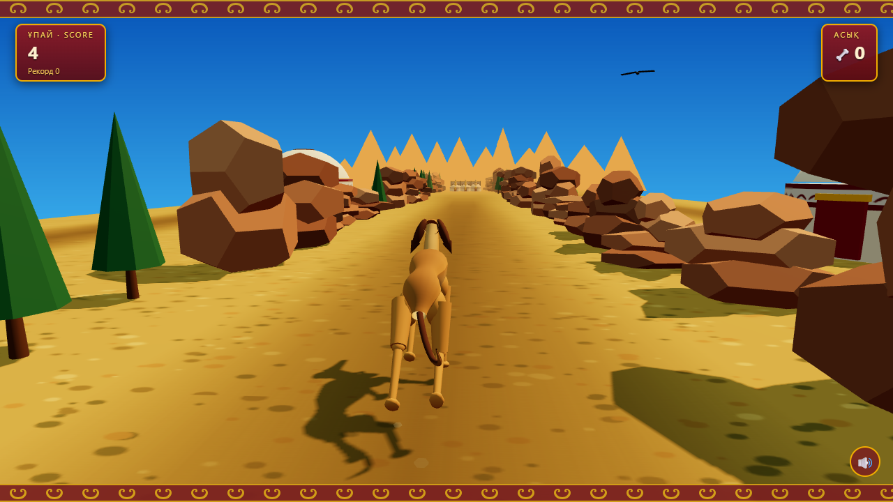

# 🐕 Тазы Runner

Бесконечный раннер в духе Subway Surfers — но в казахской степи, а главный герой — **тазы**, легендарная казахская борзая.



**Играть:** https://yesetsissenov.github.io/tazy-runner/

## Особенности

- **Узнаваемая тазы** — цельная процедурная 3D-модель с широкой грудью, подтянутым животом, длинными ногами, клинообразной головой, висячими ушами, ошейником и цельным серповидным хвостом.
- **Управляемый бег** — спокойная частота галопа, короткий и высокий прыжок, быстрый спуск и буфер следующего действия. Даже быстрый тап уверенно переносит через плетень.
- **Честный генератор волн** — непрерывный безопасный маршрут, подсказки из асыков, обучение одному действию в начале, связки на поздних этапах, запрет одинаковых волн подряд и пауза после препятствий на всю ширину.
- **Казахская степь** — юрты с орнаментным поясом «қошқар мүйіз», шаңырақ, балбалы, верблюды-бактрианы с ковровыми попонами, арбы, горы Алатау на горизонте и беркут в небе.
- **Контрастная палитра** — глубокое синее небо, золотая степь, насыщенная зелень и более заметные препятствия.
- **Асыки** вместо монет, счёт «Ұпай», интерфейс с казахским орнаментом.
- **Звук** — процедурные «домбровые» плюки в пентатонике (WebAudio, без аудиофайлов).
- Один HTML + один JS, без сборки и без ассетов: вся графика процедурная.

## Управление

| Действие | Клавиши | Тач |
|---|---|---|
| Смена полосы | ← → / A D | свайп влево/вправо |
| Прыжок | ↑ / W / Space | свайп вверх или тап |
| Подкат | ↓ / S | свайп вниз |

Плетень — перепрыгнуть, арку с тканью — проскользить снизу, юрту/верблюда/арбу — объехать.

## Запуск локально

```bash
python -m http.server 8080
# открыть http://localhost:8080
```

(Нужен любой статический сервер — ES-модули не работают с file://.)

Режим осмотра модели собаки: `?debug=dog`.

## Проверка

```bash
npm install
npm test
```

Браузерный тест проверяет короткий и высокий прыжок, правила генератора препятствий, модель тазы и компоновку на телефоне.

## Технологии

- [Three.js](https://threejs.org/) (через CDN import map)
- HTML5 Canvas для процедурных текстур (степь, орнаменты, небо)
- WebAudio API для звука
